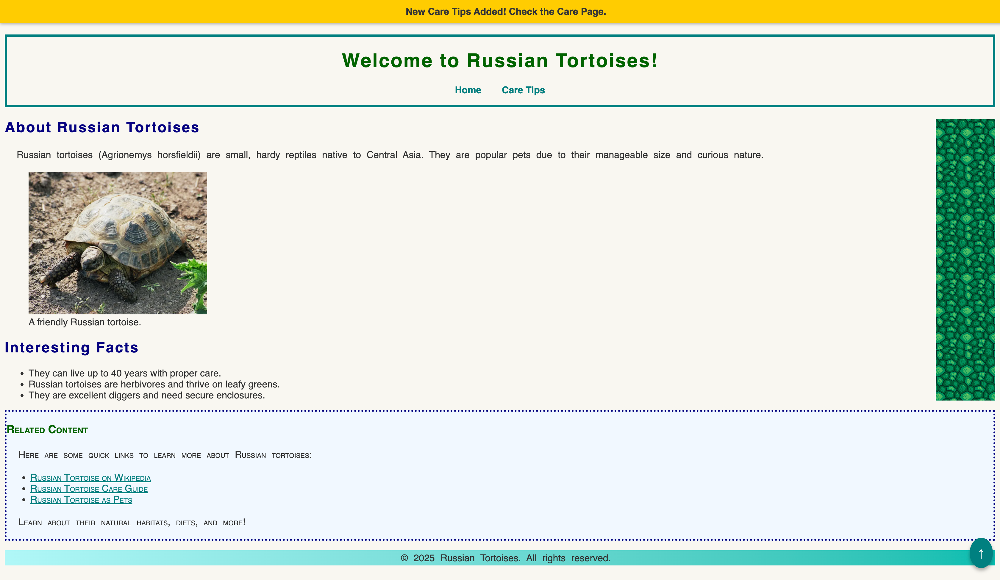

### U05-CW08 - Position Property (Lab)

#### **Objective:**

Students will learn how to create a **"Back to Top" button** using the `position` property and the **bookmark technique** (anchor tags) to scroll the page to the top.

### 1. **Open Your Project**

- Open your "Russian Tortoises" website files in your text editor.

### 2. **Add the Back to Top Button in HTML**

- Inside both the `index.html` and `care.html` files, add a **button** wrapped in an **anchor tag** just before the closing `</body>` tag. Use the following code:

```html
<!-- Back to Top Button -->
<a href="#top">
  <button id="back-to-top" title="Go to top">↑</button>
</a>
```

- Add an `id` attribute with the value `top` to the `<body>` tag in both `index.html` and `care.html`. This will serve as the bookmark for the top of the page.

```html
<body id="top"></body>
```

### 3. **Style the Back to Top Button with CSS**

- Open the `styles.css` file.
- Add a new comment `/* Back to Top Button */` to the bottom of your CSS file.
- Underneath the comment, create a new rule set for the `#back-to-top` button with the following declarations:

  - Set the `position` to `fixed` to keep the button in the same place on the screen.
  - Set the `bottom` to `20px` to position the button 20 pixels from the bottom of the screen.
  - Set the `right` to `20px` to position the button 20 pixels from the right of the screen.
  - Set the `background-color` to `#008080` (a teal color) for the button background.
  - Set the `color` to `white` for the text color.
  - Remove the border by setting `border` to `none`.
  - Make the button circular by setting `border-radius` to `50%`.
  - Add `15px` of padding around the button to make it larger.
  - Set the `font-size` to `18px` to make the arrow symbol larger.
  - Change the cursor to a pointer on hover by setting `cursor` to `pointer`.

- Create another rule set that selects the `#back-to-top` button when it is hovered over (`#back-to-top:hover`) with the following declaration:
  - Change the `background-color` to `#006400` (a darker green) when the button is hovered over.

### 4. **Testing Your Work**

- Open `index.html` in a browser.
- Scroll down the page to see the **"Back to Top" button** appear in the bottom-right corner.
- Click the button to ensure it scrolls the page back to the top.
  - You may need to add additional content in the main section to see this effect
- Hover over the button to see the **color change effect**.

### 5. **Submit Your Work**

- Once you've confirmed that the button works and looks good, submit the following files inside Google Classroom:
  - `index.html`
  - `care.html`
  - `styles.css`

### 6. **Screenshot of Completed Assignment**


